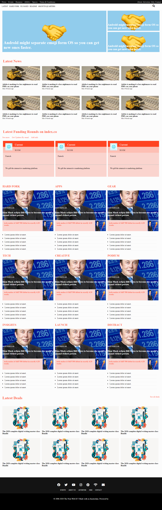

# TheNewWeb

This is a Clone of the Next Web Website To demonstrate the use of floats, CSS grids, Flexbox and Mediaqueries to create a responsive website

## Screenshot of our cloned website

## Buit with

- HTML
- CSS3
- Font awesome icons

## live Demo

Click! [Here](https://raw.githack.com/Ralph-1/TheNextWeb/development/index.html)   

## To get a local copy up and running follow these simple example steps.

## Setup

Clone the project locally.

## Linters

1. run npm install.
2. run npm run test to check the Html and Css files.

## Deployment

Install and run a live server plugin on you IDE/Text editor and run it from the root directory.

## Authors
 
- 👤 Ralph Oburu [@Ralph-1](https://github.com/Ralph-1) 

## Show your support

Give a ⭐️ if you like this project!

## 📝 License

This project is [MIT]licensed.